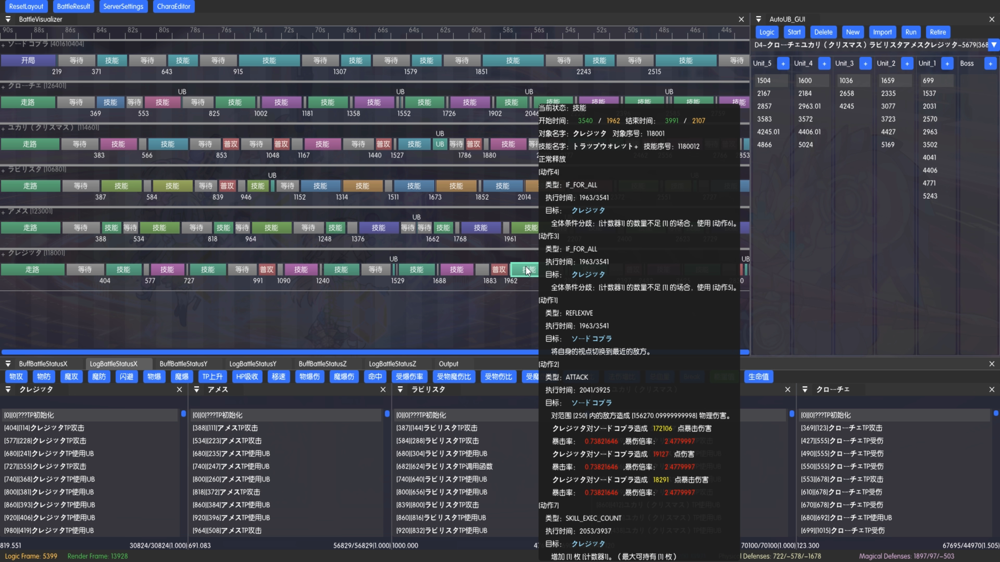

# PrincessStudioManual

Princess Studio is a timeline creation tool.

[Discord Server](https://discord.gg/UJdZkzCHSh)

This Manual contains basic usage of Princess Studio, and some introductory knowledge of common timeline creation technique. If you wish to contribute in sharing timeline creation technique, you may file a pull request or an issue.

* [Introductions](introductions/README.md)
  - [Overview](introductions/Overview.md)
  - [Start JP](introductions/FirstSteps.md) or [Start TW](introductions/FirstSteps_TW.md)
  - [Timeline Creation](introductions/CreateTL.md)
* [Concepts]()
  - [Logic Frame](Concepts/LogicFrame.md)
* [PrincessStudio]()
  - [Hotkeys](PrincessStudio/Hotkeys.md)
  - [ServerSettings]()
  - [CharaEditor]()
  - [AutoUB_GUI]()
  - [AutoUB_CLI]()
  - [BattleVisualizer]()
  - [BattleStatus]()
  - [BattleResult]()