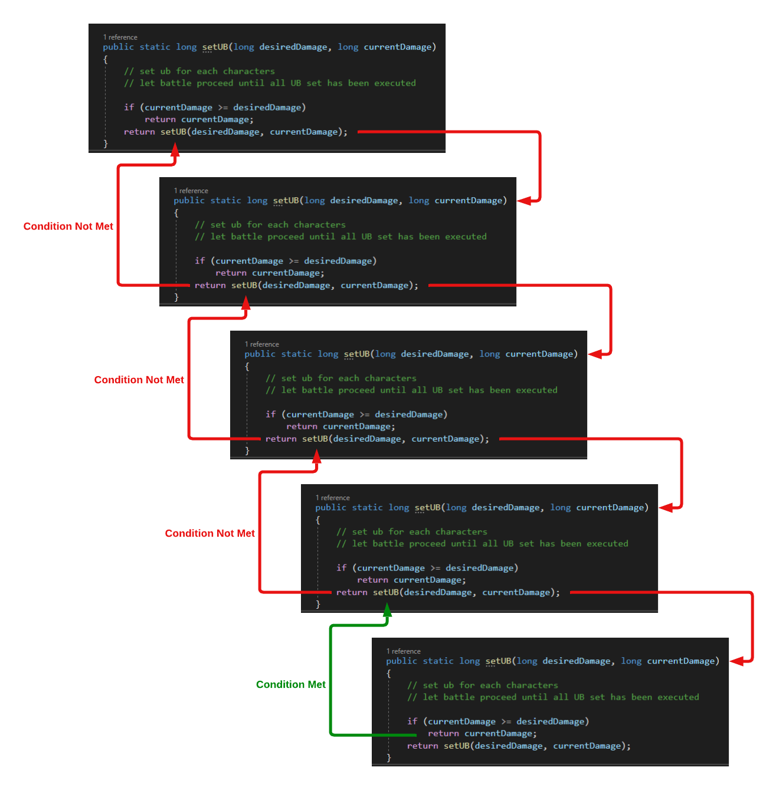

##### 1. Concept and Thinking Process
Timeline creation is a recursive process. See the following diagram for a better picture:

###### 1.1 What we are essentially doing is breaking union burst execution times into waves.

###### 1.2 When we are satisfy with the current wave, we proceed to the next wave.

###### 1.3 If a previous wave has direct impact on the outcome of current wave, we go back to adjust the causing wave to make the current wave satisfactory.

##### 2. How Princess Studio Helps
Princess Studio provides graphical details of the battle, including skill starting frame, ending frame, and effective frame. Princess Studio show these details using bar graph and listbox. Another important feature Princess Studio assists in the timeline creation process is the AutoUB feature. AutoUB allows you to set union burst execution frame so the character will attempt to execute the frame you set when it is possible.