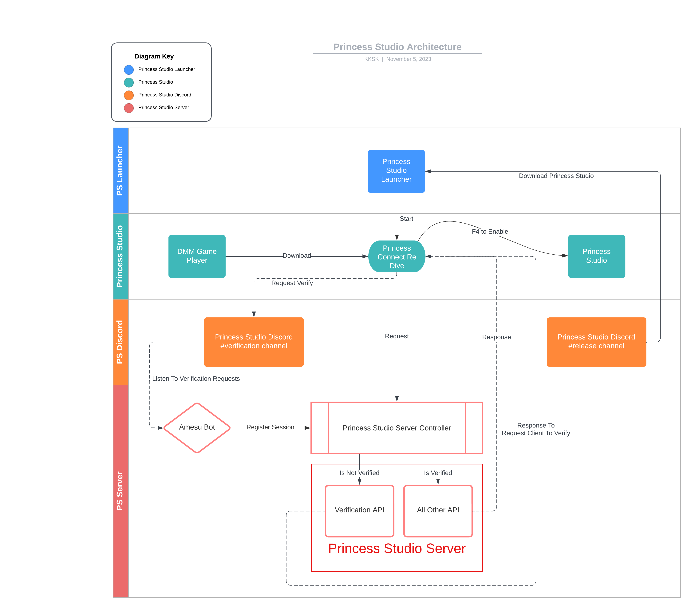

##### 1 What is Princess Studio?
[PrincessStudio](https://github.com/krulci/PrincessStudioManual) is a timeline creation tool for the game [PrincessConnectReDive](https://priconne-redive.jp/).

###### 1.1 History
Version 1.0.0.0 to 2.0.0.0:
- Support mono version of PrincessConnectReDive prior to version 7.2.0.
- Used Microsoft Winform as UI.
- Used TCP to bridge game and external UI.
- Had a major draw back when the game is constantly making requests to the UI TCP server, mainly when using Muimi.
- Also suffer from high speed battle with speed greater than 128 times of the normal speed.

Version 2.0.0.0 to 3.0.0.0:
- Support il2cpp version of PrincessConnectReDive starting from version 7.2.0.
- Had all features included in prior version.

Version 3.0.0.0+:
- So called PsImGui.
- Uses ImGui as UI.
- UI is a separate thread hooked to Unity's Update method.
- Resolves the issue with high frequency of requests and game speed.

###### 1.2 Compartments
PrincessStudio has multiple compartments:
- [ServerSettings]() allows users to set configurations to server responses such as current clan battle id and lap.
- [CharaEditor]() allows users to customize character properties.
- [AutoUB_GUI]() allows users to set UB by input frames using PrincessStudio's UB input GUI.
- [AutoUB_CLI]() allows users to set conditional commands of UB execution using PrincessStudio's UB execution API.
- [BattleVisualizer]() provides visualization of the battle timeline using horizontal bar graph.
- [BattleStatus]() displays battle statuses of each units in battle using listboxes.
- [BattleResult]() serializes historic battle and presents in a property grid for recalls.

###### 1.3 Architecture
Below is an image describing PrincessStudio's architecture and the compartments in its ecosystem:
